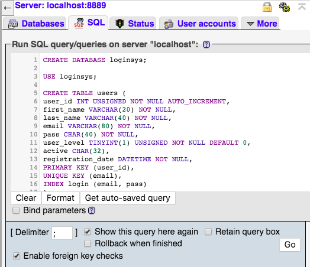

# <strong>Login System</strong> :pencil2:
A short and simple php login system implementation.

# <strong>Steps for Running</strong>

<strong>First, Create your database for users</strong>

Visit phpMyAdmin and insert the sql statement found in the 'users.sql' file.

It should look something like this :

