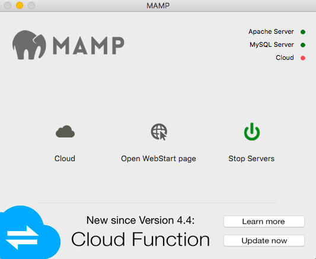

# PHP : Hypertext Preprocessor

 

   
 

A widely used open source scripting language. Specially Designed for the web.

# How to serve php web applications
To run php application locally you will need to set up a local testing server,
such as MAMP or XAMPP. This isn't a difficult process at all, both local server
solutions have an easy-to-use front end user-interface.

# Using MAMP & MySQL :globe_with_meridians:

The database and server configurations for MAMP & MySQL can be found at the <strong>start</strong> tab.
This can be accessed through the <em>Open WebStart page</em> from the MAMP interface.

<strong>Mamp Interface</strong>
  

<strong>Database and Server Configurations</strong>
  

<strong>Examples</strong>
  

# Getting MAMP to point to your project directory :file_folder:

In order for our web applications to become viewable on the mamp server, we must first tell MAMP where our project directory is located. This way MAMP can properly display our web application through their local server.

1. Start by opening MAMP, then in the top left corner select the <strong>MAMP</strong> tab and select the <em>preferences</em> option 

  

2. Once you select the preferences option, you will see more server options appear. We will only need to focus on the <strong>Web-Server</strong> option for now. Select the <strong>Web-Server tab</strong> and you will be redirected to a file directory window.

  

3. Lastly, you will just need to find where you project is located, go to that location and click on your project. Now MAMP will know where to find and point to your project files.

  

# Getting Started with PHPMyAdmin
phpMyAdmin is a free web interface that allows users to write and administer MYSQL databases.   
